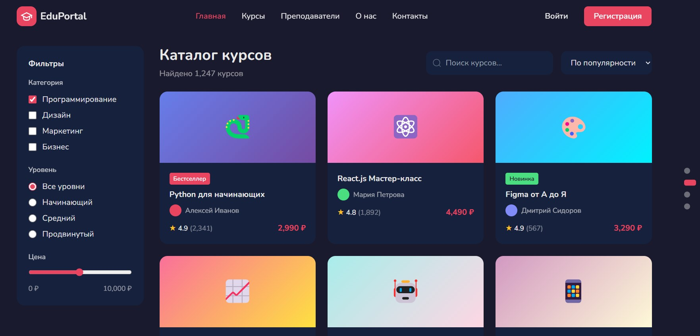
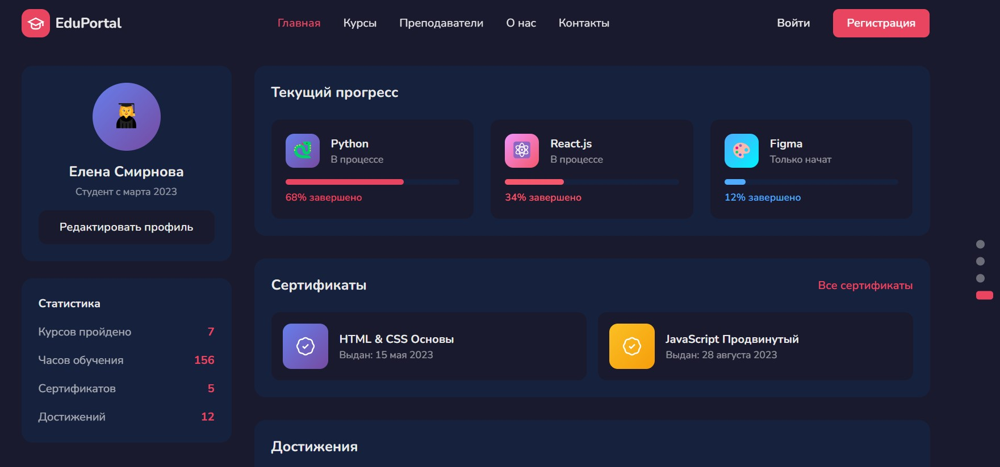

# Отчёт по заданию  
## Создание дизайн-макета IT-продукта для компонента образовательной среды

### 1. Цель работы

Целью данной работы является разработка дизайн-макета IT-продукта, предназначенного для использования в образовательной среде. Макет отражает структуру и логику пользовательского интерфейса электронного образовательного ресурса и демонстрирует основные пользовательские сценарии взаимодействия с платформой.

---

### 2. Описание IT-продукта

В рамках задания был разработан дизайн-макет образовательной онлайн-платформы, предназначенной для размещения курсов, управления учебным контентом и взаимодействия обучающихся с образовательными материалами.

---

### 3. Структура дизайн-макета

Дизайн-макет включает следующие ключевые экраны:

#### 3.1 Главная страница платформы

Главная страница предназначена для первичного знакомства пользователя с образовательной платформой. На странице размещена информация о возможностях сервиса, ключевых преимуществах и навигационных элементах.

---

#### 3.2 Страница со списком курсов

Данный экран отображает перечень доступных образовательных курсов. Пользователь может ознакомиться с каталогом курсов и выбрать интересующее направление обучения.

---

#### 3.3 Страница отдельного курса

Страница курса содержит информацию о выбранном учебном курсе, его структуре и содержании. Данный экран является основным рабочим пространством обучающегося в процессе изучения материала.

---

#### 3.4 Страница обучающегося (личный кабинет)

Личный кабинет обучающегося предназначен для отображения персональной информации пользователя, его прогресса в обучении и доступа к ранее начатым курсам.

