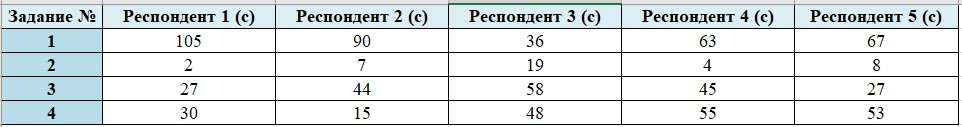
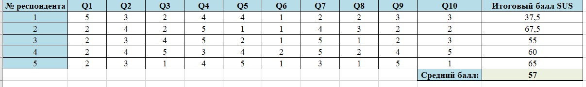

# Организация и проведение юзабилити-тестирования сайта образовательного учреждения  
*(на примере сайта ГБОУ Гимназия №159 "Бестужевская")*

---
# Организация и проведение юзабилити-тестирования  
компонента образовательной среды образовательного учреждения
Целью тестирования является определение удобства и логики построения сайта.
**Метод:** Usability Testing  
**Сайт для проверки:** https://gymnasium159.edusite.ru/  
**Число респондентов:** 5

---

## Задачи тестирования
Респондентам было предложено выполнить следующие задачи:
1. Найти информацию о приёме в образовательное учреждение;  
2. Найти контакты администрации гимназии;  
3. Найти информацию о проводимых мероприятиях или олимпиадах;  
4. Найти страницу с достижениями учащихся.

---

## Результаты выполнения заданий
### Время выполнения заданий (в секундах)

---

## Наблюдения по результатам тестирования
По результатам выполнения заданий было выявлено, что скорость поиска информации существенно различается у разных пользователей.  
Наиболее длительное время потребовалось для выполнения первого задания, что указывает на затруднения при первичном ориентировании на сайте.
Повторное выполнение задач или логическое предположение о расположении информации заметно сокращает время поиска, однако при первом обращении структура сайта воспринимается не всегда очевидно.

---

## SUS – System Usability Scale
### Что измеряет
SUS — это опросник, предназначенный для оценки общего уровня удобства использования сайта. Он состоит из 10 утверждений и позволяет получить обобщённую количественную оценку юзабилити.

---

### Результаты SUS

**Средний балл SUS:** **57**

---

## Интерпретация результатов SUS

Средний показатель SUS, равный 57 баллам, находится ниже порогового значения 68, что свидетельствует о наличии затруднений в удобстве использования сайта.  
При этом результаты указывают не на сложность сайта, а на недостаточную интуитивность навигации при первом обращении.

---

## Выводы

Сайт гимназии в целом выполняет информационную функцию, однако пользователям требуется время для адаптации к его структуре.  
Основные затруднения связаны с первичной навигацией и визуальной организацией разделов, что подтверждается как результатами выполнения заданий, так и показателями по шкале SUS.

